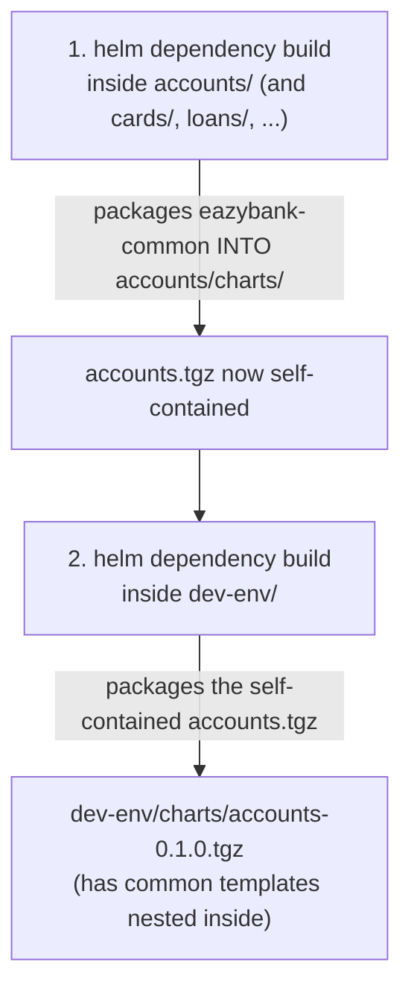

# `helm dependency build` — Exactly Which Layer(s) It Runs On

## Short answer

**You need to run it on TWO layers, in this order — bottom to top:**

```
1st →  EVERY Step 2 microservice chart that depends on eazybank-common
        (accounts, cards, loans, configserver, eurekaserver, gatewayserver, message)
2nd →  Step 3, the umbrella chart (dev-env)
```

Not just `dev-env`. This is the part my last answer got wrong by oversimplifying.

---

## Why it's needed at Step 2 (each microservice) FIRST

Look at `accounts/Chart.yaml`:
```yaml
dependencies:
  - name: eazybank-common
    version: 0.1.0
    repository: file://../../eazybank-common
```

`accounts` **itself** declares a dependency on the library chart. That means `accounts` needs its *own* `charts/` folder containing `eazybank-common-0.1.0.tgz`, or its templates (`{{ template "common.deployment" . }}`) have nothing to call.

So inside `accounts/`:
```bash
cd eazybank-services/accounts
helm dependency build
```
This creates:
```
accounts/
├── Chart.yaml
├── Chart.lock       ← new
├── values.yaml
├── templates/
└── charts/          ← new
    └── eazybank-common-0.1.0.tgz
```

**You must do this for every microservice chart individually** — `cards`, `loans`, `configserver`, `eurekaserver`, `gatewayserver`, `message` — since each one separately declares the same dependency on `eazybank-common` in its own `Chart.yaml`.

---

## Why it's needed at Step 3 (`dev-env`) SECOND

Now look at `dev-env/Chart.yaml`:
```yaml
dependencies:
  - name: eazybank-common
    ...
  - name: accounts
    version: 0.1.0
    repository: file://../../eazybank-services/accounts
  - name: cards
    ...
```

When you run `helm dependency build` inside `dev-env`, Helm packages the **entire `accounts/` folder** — including whatever is already sitting in `accounts/charts/` — into `dev-env/charts/accounts-0.1.0.tgz`.

```bash
cd environments/dev-env
helm dependency build
```
This creates:
```
dev-env/
├── Chart.yaml
├── Chart.lock
├── values.yaml
├── templates/
└── charts/
    ├── eazybank-common-0.1.0.tgz
    ├── accounts-0.1.0.tgz        ← this .tgz has eazybank-common BUNDLED INSIDE IT
    ├── cards-0.1.0.tgz           ← same
    ├── loans-0.1.0.tgz
    └── ...
```

---

## Why the ORDER matters — this is the part that actually breaks if skipped

If you run `helm dependency build` in `dev-env` **before** running it inside `accounts`:

- `accounts/charts/` is still empty (no `eazybank-common-0.1.0.tgz` inside it).
- Helm packages `accounts/` *as-is* — meaning the broken/incomplete version, missing its own nested dependency.
- At install/render time, `accounts`'s templates call `{{ template "common.deployment" . }}` — but the `common.*` functions were never packaged inside `accounts`'s bundle, so rendering **fails** with an error like `template: no template "common.deployment" associated with template`.



**Bottom-up, always.** Build the innermost dependency layer first, then the layer that wraps it.

---

## Practical command sequence for your project

```bash
# Step 2 — once per microservice chart
cd eazybank-services/accounts        && helm dependency build && cd -
cd eazybank-services/cards           && helm dependency build && cd -
cd eazybank-services/loans           && helm dependency build && cd -
cd eazybank-services/configserver    && helm dependency build && cd -
cd eazybank-services/eurekaserver    && helm dependency build && cd -
cd eazybank-services/gatewayserver   && helm dependency build && cd -
cd eazybank-services/message         && helm dependency build && cd -

# Step 3 — once, at the umbrella chart, LAST
cd environments/dev-env && helm dependency build
```

## When to re-run each one

| You changed... | Re-run `dependency build/update` in... |
|---|---|
| Something inside `eazybank-common` (a `define` block) | Every Step 2 microservice chart, **then** `dev-env` |
| A microservice's `values.yaml`, `templates/`, or bumped its own `Chart.yaml` version | That one microservice chart, **then** `dev-env` |
| `dev-env/Chart.yaml`'s dependency list (added a new service, changed a version) | Just `dev-env` — but use `helm dependency update` here, not `build`, since the lock file needs to be regenerated to match the new `Chart.yaml` |
